# SSAFY 10기 공통 PJT - A507 Front-End README

## 1. FE 개발 환경

### 1.1. FE 기술 스택
```
vscode 1.85.1
node.js 20.10.0
npm 10.2.3
vue 3
vue/cli 5.0.8
vuetify 3 - vue cli (preview)
vue-router 4.2.5
pinia 2.1.7
prettier: 3.1.1
eslint: 7.32.0
axios: 1.6.5
toast-ui/editor: 3.2.2
pinia-plugin-persistedstate
```

### 1.2 FE 디자인
- Figma

### 1.3 FE 브랜치 전략
```
master
  ├── be-deploy
  │       .
  │       .
  │       .
  │
  └── fe-deploy
          └── fe-develop
                    ├── Feat_1
                    ├── Feat_2
                    └── Feat_3
                          .
                          .
                          .
```

- `master`에서 프론트/백엔드 프로젝트를 각각 배포하기 위해 `fe-deploy`와 `be-deploy`로 브랜치를 나누었습니다.
- 프론트엔드 프로젝트는 `fe-deploy`, `fe-develop`, `Feat`로 나누어 개발하였습니다
  - `fe-deploy`: 테스트가 완료된 단계에서 배포에만 사용하는 브랜치
  - `fe-develop`: 개발된 기능을 merge하고 테스트하는 브랜치
  - `Feat`: 기능 단위로 독립적인 환경에서 개발하는 브랜치
- `Feat`에서 개발을 마치면 `fe-develop`에 merge 후 테스트
- 이상이 없으면 `fe-deploy`에 merge함으로써 배포

<br/>
<br/>

## 2. FE 폴더 구조

```
frontend
  └── decode
      ├── node_modules
      ├── public
      ├── .env
      ├── package.json
      ├── package-lock.json
      └── src
            ├── plugins
            ├── utils
            ├── router
            ├── store
            ├── view
            └── components
                      ├── answer
                      ├── chat
                      ├── comment
                      ├── common
                      ├── main
                      ├── openvidu
                      ├── profile
                      ├── question
                      ├── rank
                      ├── shop
                      └── user
```

## 3. FE 역할 분담

### 정진영
- **UI**
  - 페이지
    - 메인 페이지
    - 질문게시판 페이지
    - 질문 상세 페이지
    - 질문 제목 생성 페이지
    - 질문 / 답변 생성 페이지
    - 질문 / 답변 수정 페이지
  - 컴포넌트
    - 네비게이션 바
    - 질문 검색 창
    - 마크다운 에디터: 질문 / 답변 작성 / 수정 시 사용(Toast Editor)
    - 마크다운 뷰어: 질문 / 답변 출력(Toast Viewer)
- **기능**
  - 질문
    - CRUD
    - 나도 궁금해요, 북마크
    - 질문 생성 / 수정 시 기술 스택 태그 추가/삭제
    - 질문 생성 시
      - 에러 코드 입력 시 GPT API를 통해 제목 및 관련 기술 태그 생성
    - 질문 제목 / 기술 태그로 검색
  - 답변
    - CRD
    - 추천, 채택
    - 질문 생성이 완료되면 GPT / Stackoverflow API를 통해 관련 답변 받기
  - 댓글
    - CRD


### 엄세원
- **UI**
  - 페이지
    - 로그인 페이지
    - 회원가입 페이지
    - 회원가입 시 기술스택 선택 페이지
    - 계정 / 비밀번호 찾기 페이지
    - 마이페이지
    - 회원정보 수정 페이지
  - 컴포넌트
    - 하단 바
    - 로그인 form
    - 회원가입 form
    - 회원정보
    - 작성한 질문,답변 / 팔로워 / 팔로잉 탭
- **기능**
  - 회원
    - 로그인
    - 회원가입 / 기술 스택 입력
    - 회원정보 / 기술 스택 수정
    - 계정 / 비밀번호 찾기
  - 소셜
    - 팔로우 / 팔로우 취소
  - 권한
    - 특정 페이지 로그인 없이 접근 제한 설정
    - 유효하지 않은 경로 접근 404 페이지 설정


### 서재화
- **UI**
  - 컴포넌트
    - 채팅 모달
    - 화면 공유 컴포넌트
- **기능**
  - 채팅
  - 화면 공유


### 박우철
- **UI**
  - 컴포넌트
    - 출석 스트릭
    - 경험치 그래프
- **기능**
  - 회원
    - 출석 스트릭
    - 경험치
    - 기술 스택 수정
  - 기타
    - 마이페이지 코드 리팩토링


### 제선명
- **UI**
  - 페이지
    - 랭킹 페이지
  - 컴포넌트
    - 랭킹 검색창
    - 랭킹 테이블
  - 기타
    - 최종 UI 수정
- **기능**
  - 소셜
    - 경험치 / 티어 기능
    - 랭킹 검색 기능

<br/>
<br/>

## 4. 페이지 별 기능 소개

### 메인 페이지
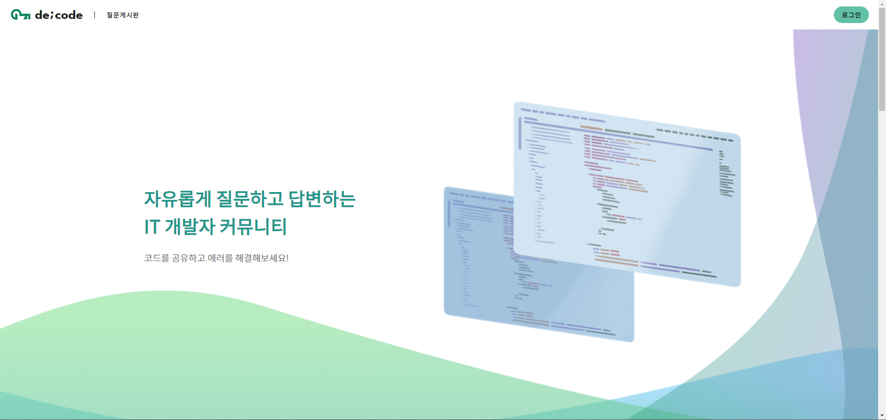
<br/>

- 서비스의 기능과 목적을 알 수 있습니다


### 회원가입 / 기술 스택 선택 페이지
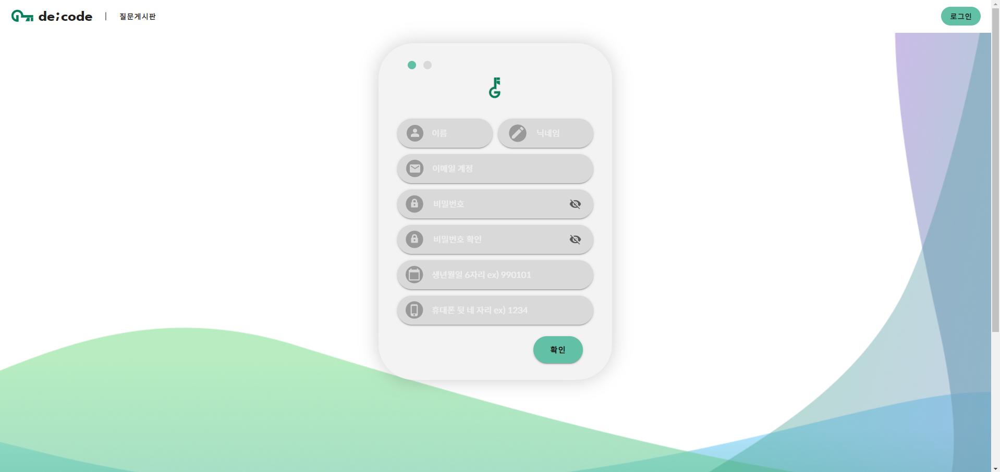
<br/>

- 회원가입을 진행할 수 있습니다.

<br/>
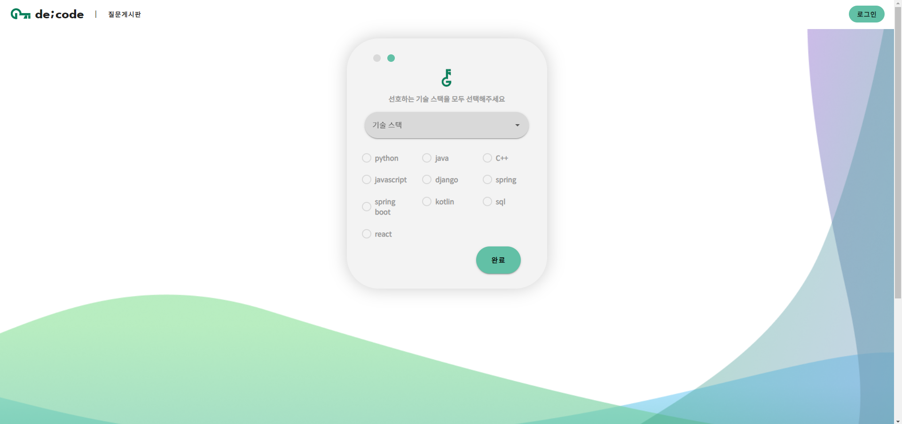
<br/>

- 회원가입을 하면, 자신이 사용하거나 선호하는 기술 스택을 선택할 수 있습니다.

### 로그인 페이지
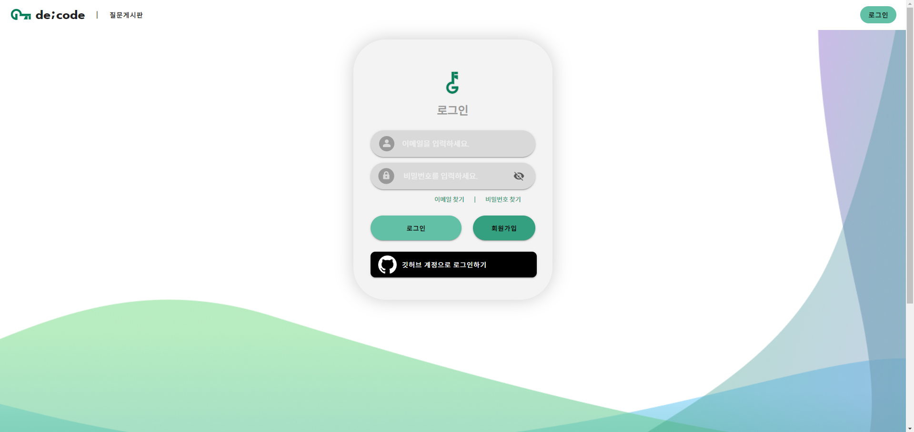
<br/>

- 로그인 페이지입니다. 깃허브 계정을 통한 로그인과 회원가입 또한 가능합니다.

### 질문 게시판 페이지
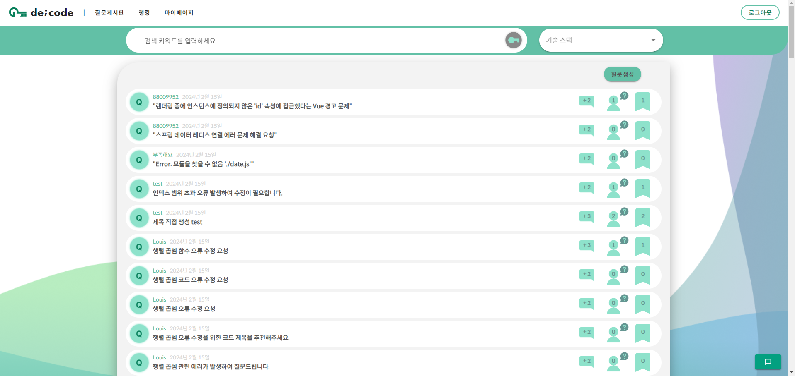
<br/>

- 질문 게시판입니다. 코딩하다 마주친 에러나 궁금한 점에 대해 자유롭게 질문을 등록할 수 있습니다.
- 검색을 통해서 이미 누군가가 올린 질문과 답변을 찾을 수 있습니다.

### 질문 제목 / 질문 생성 페이지

<br/>

- 코딩하다 마주친 에러, 궁금한 점을 입력하면, GPT가 제목과 관련 태그를 자동 생성해줍니다.

<br/>
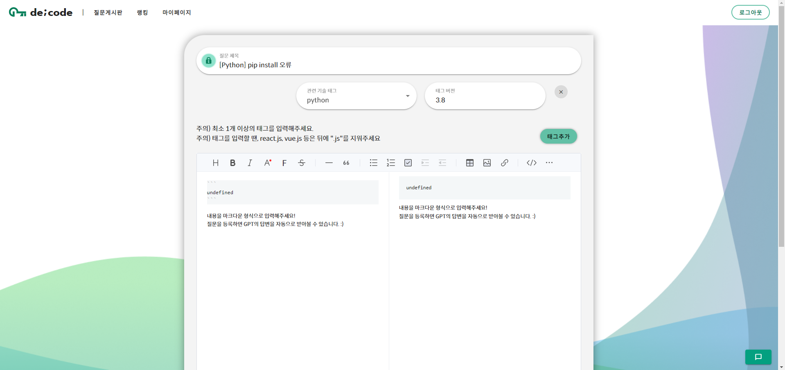
<br/>

- 자동 생성된 태그의 버전을 입력하고, 질문 사항을 적으면 질문이 생성됩니다.
- 질문은 마크다운 에디터를 통해 원하는 형식으로 입력 가능합니다.
- 질문 생성이 완료되면, GPT 생성 답변과 Stackoverflow의 유사 질문에 대한 답변을 받을 수 있습니다.

### 질문 상세 페이지
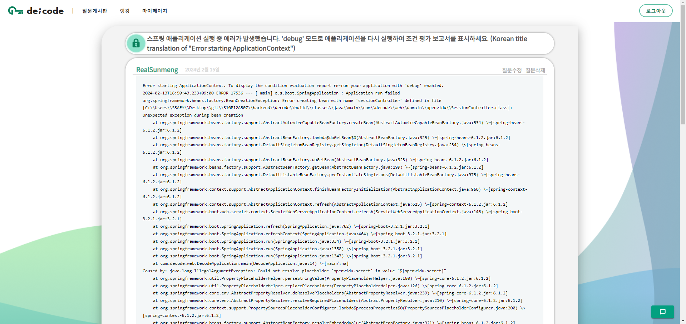
<br/>

- 사용자들이 게시한 질문의 내용과 기술 태그, 버전을 확인할 수 있습니다.
- 마크다운 뷰어를 통해, 사용자가 작성한 마크다운 형식으로 출력해줍니다.
- 질문의 수정 / 삭제가 가능합니다.
- 사용자들은 질문에 대해 나도 궁금해요, 북마크의 기능을 사용할 수 있습니다. 답변이 채택되면, 나도 궁금해요를 눌렀던 사용자들에게 메일을 발송하여 알려줍니다.

<br/>

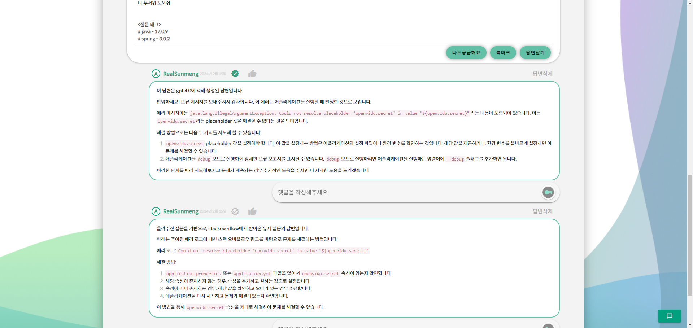
<br/>

- 해당 페이지에서 위와 같이 답변과 댓글을 남기고 확인할 수 있습니다.
- 위 사진은, 질문을 생성했을 때 받은 GPT의 답변과, Stackoverflow의 유사 질문에 대한 답변의 예시입니다.

<br/>

<br/>

- 댓글을 생성한 예시입니다.

### 질문 수정 페이지
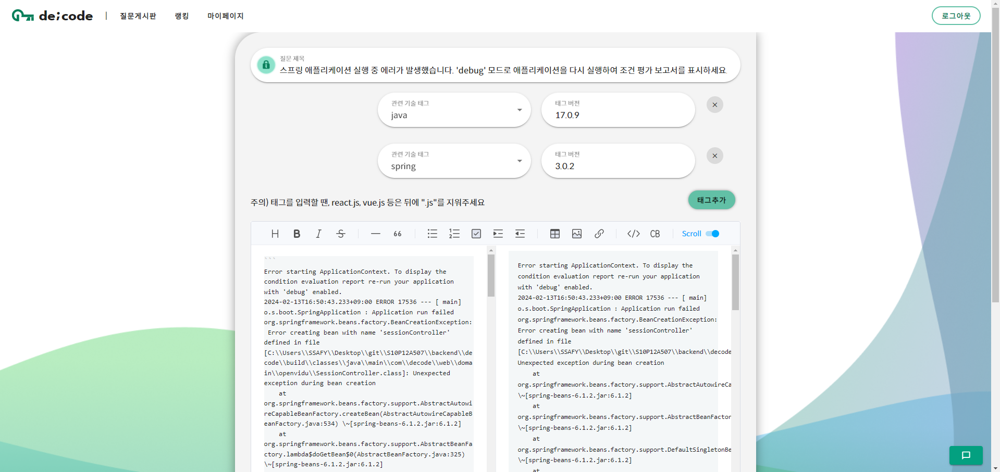
<br/>

- 질문 상세페이지에서 질문을 수정할 수 있습니다.

### 답변 생성
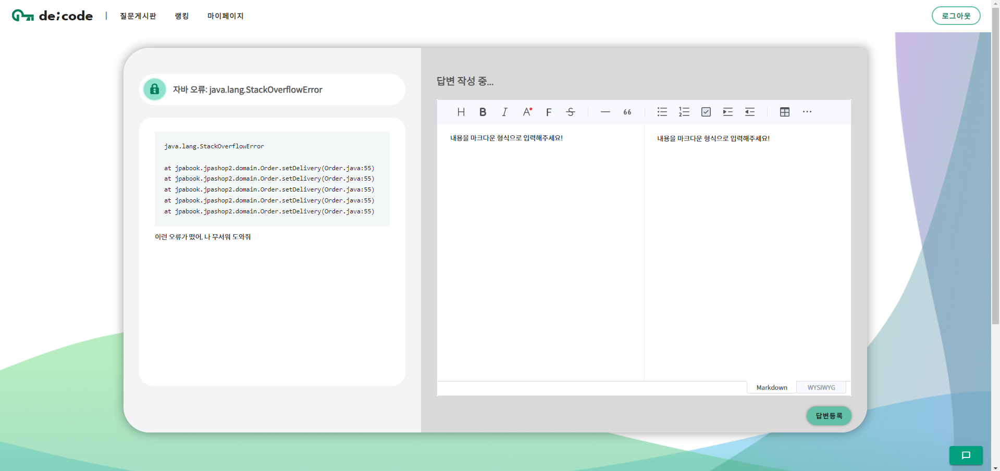
<br/>

- 질문 상세 페이지에서 사용자들이 직접 답변을 남길 수 있습니다.
- 답변 또한 질문과 같이 마크다운 형식으로 작성할 수 있습니다.

### 채팅방 / 화면 공유
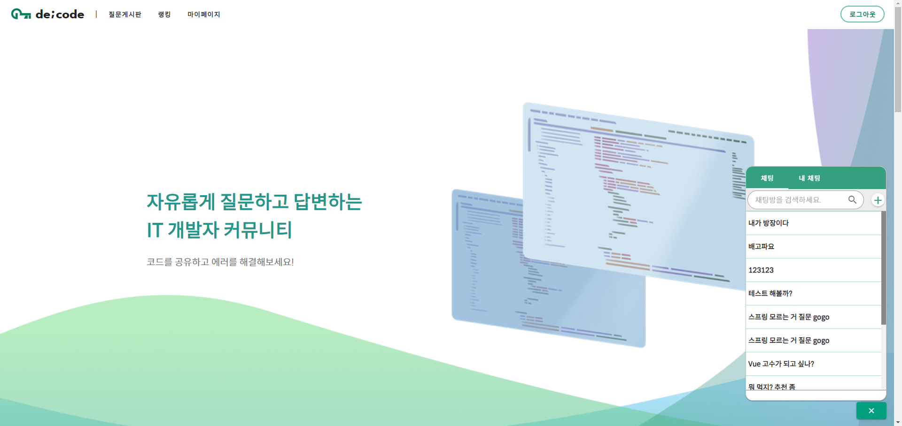
<br/>

- 우측 하단의 아이콘을 누르면 채팅방의 목록을 확인할 수 있습니다.

<br/>
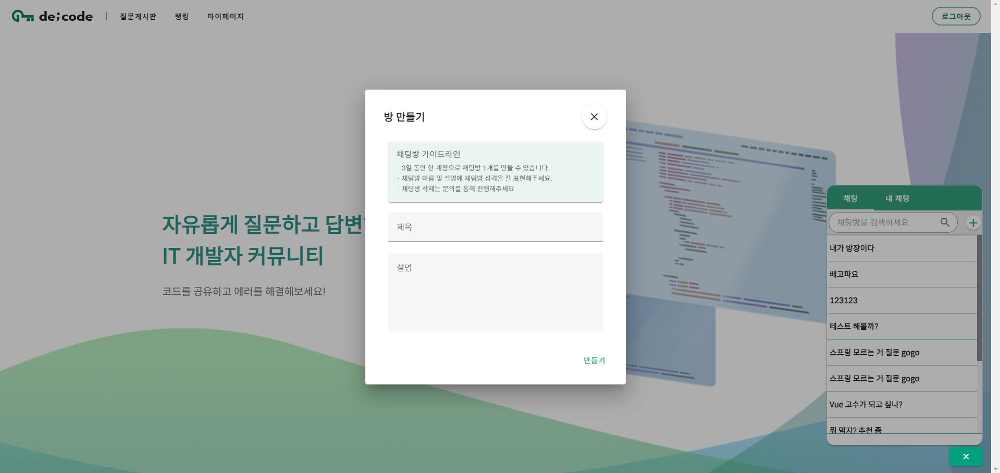
<br/>

- 채팅방을 직접 생성하여, 사용자 간 직접 질문을 통해 도움을 받을 수 있습니다.

<br/>
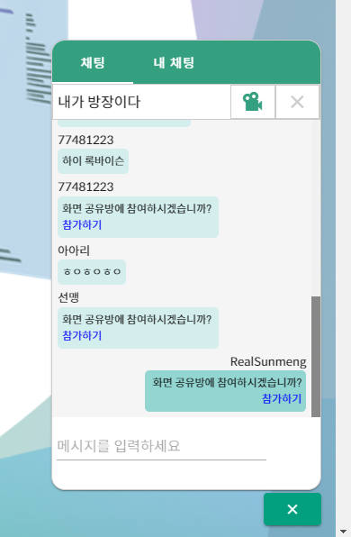
<br/>

- 채팅방의 모습입니다.

<br/>
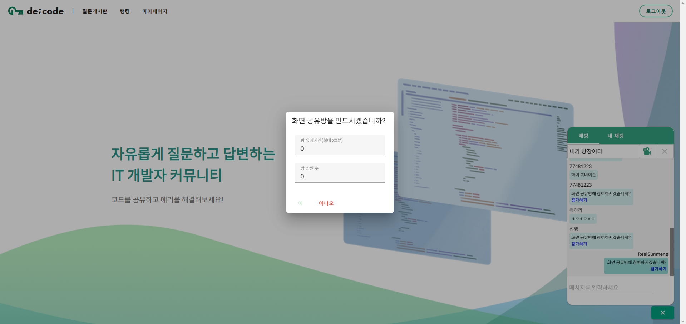
<br/>

- 채팅으로 설명이 부족할 땐, 화면 공유를 통해 더욱 원활한 소통이 가능합니다.

<br/>
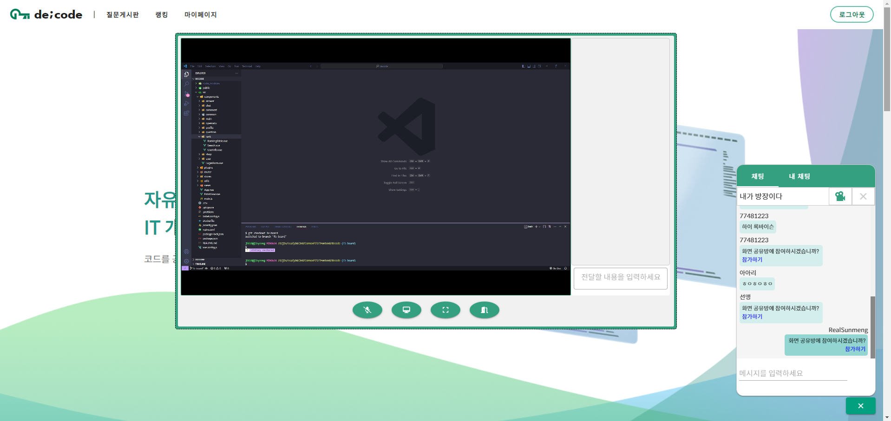
<br/>

- 화면 공유를 하는 중에도 음성 대화, 채팅 또한 가능합니다.

### 랭킹 페이지
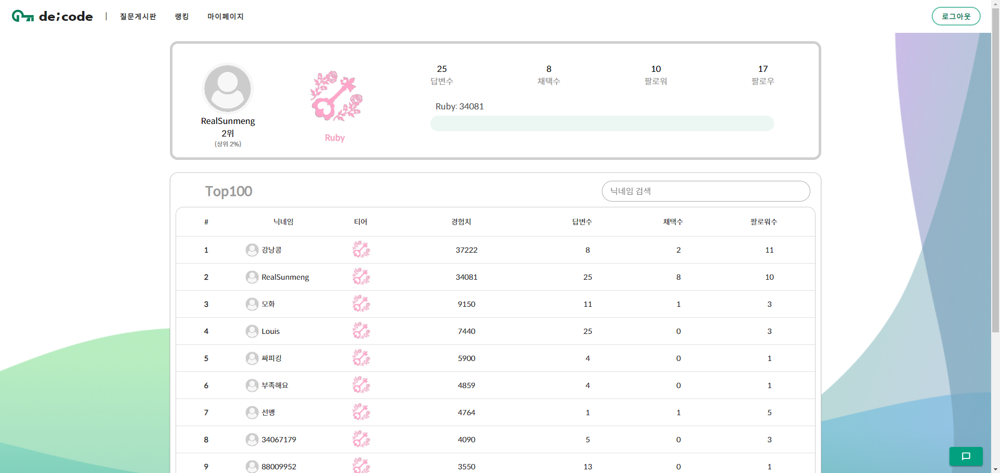
<br/>

- 사용자의 경험치, 티어, 랭킹을 확인할 수 있습니다.

### 마이 페이지
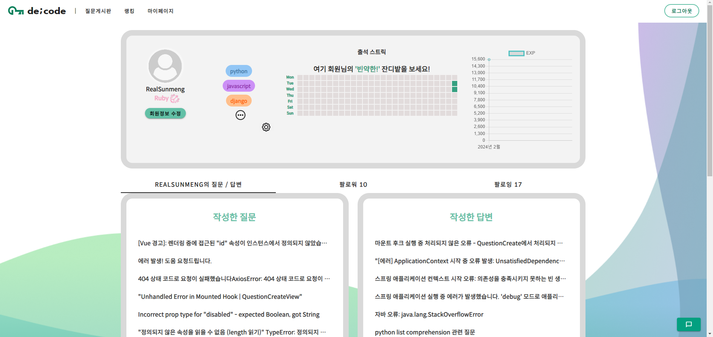
<br/>

- 사용자와 관련된 정보들을 볼 수 있습니다.
- 화면 상단에서는 기술 스택, 출석 스트릭, 경험치 변동 추이를 볼 수 있습니다.
- 하단부에 있는 탭을 통해서는 사용자가 남긴 질문, 답변을 남긴 질문 목록과 함께 팔로워 / 팔로잉 목록을 확인할 수 있습니다.
- 다른 사용자의 페이지도 동일한 형식으로 이루어져 있습니다.

<br/>
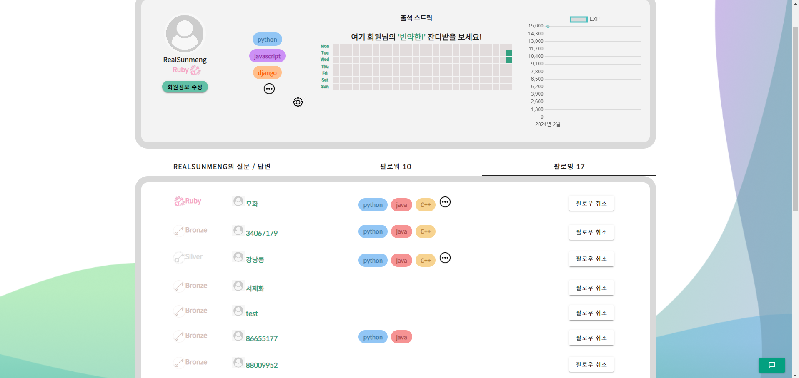
<br/>

- 하단부 탭에서 팔로잉 목록을 확인하는 예시입니다.
- 내가 팔로우하는 사람의 기술 스택을 확인할 수 있고, 팔로우 취소가 가능합니다.
- 팔로우 목록도 동일한 형식입니다.

<br/>
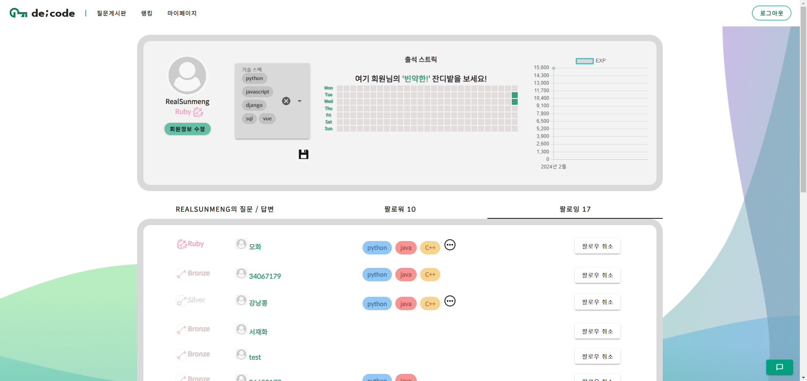
<br/>

- 화면 상단부에서 사용자의 기술 스택을 변경할 수 있습니다.

<br/>
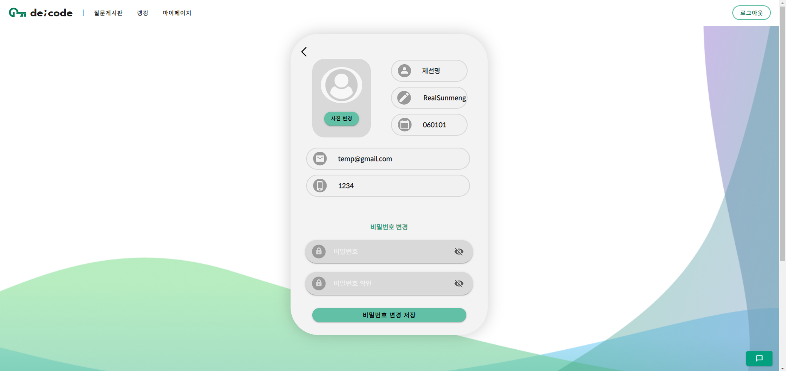
<br/>

- 회원정보 수정 버튼을 통해 회원 정보 수정 페이지로 이동할 수 있습니다.

<br/>
<br/>


## 5. 트러블 슈팅
- 이슈 1
- 이슈 2